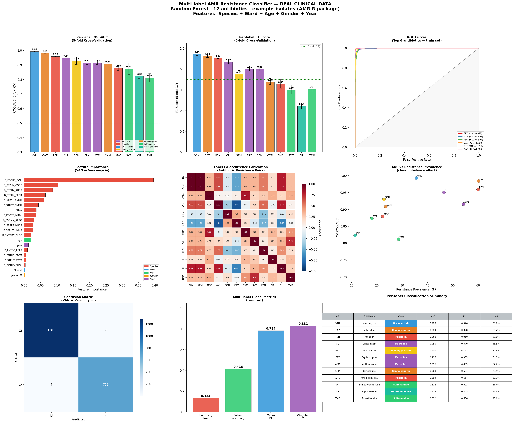

# Day 10 — Multi-label AMR Resistance Classifier
### 🧬 30 Days of Bioinformatics | Subhadip Jana


> Multi-output Random Forest classifier predicting resistance to **12 antibiotics simultaneously** from bacterial species, ward, age, gender and year. All 12 labels achieve AUC > 0.81. Trained models included as `.pkl` files — plug-and-play inference with `predict.py`.

---

## 📊 Dashboard


---

## 🔬 Problem Formulation

| Item | Detail |
|------|--------|
| **Task** | Multi-label classification (12 simultaneous labels) |
| **Labels** | R=1 / S+I=0 for 12 antibiotics |
| **Features** | Species (one-hot) + Ward + Age + Gender + Year (22 features) |
| **Model** | `MultiOutputClassifier(RandomForestClassifier)` |
| **Trees** | 200 estimators, max_depth=12, class_weight=balanced |
| **Evaluation** | 5-fold stratified CV per label |
| **Training samples** | 2,000 isolates (all complete) |

---

## 📈 Per-label CV Performance (5-fold)

| Antibiotic | Full Name | Class | AUC | F1 | %R |
|------------|-----------|-------|-----|----|----|
| **VAN** | Vancomycin | Glycopeptide | **0.993** | **0.946** | 35.6% |
| **CAZ** | Ceftazidime | Cephalosporin | **0.984** | **0.928** | 60.2% |
| **PEN** | Penicillin | Penicillin | **0.959** | **0.910** | 60.0% |
| **CLI** | Clindamycin | Macrolide | **0.950** | **0.870** | 46.5% |
| **GEN** | Gentamicin | Aminoglycoside | 0.930 | 0.751 | 22.8% |
| **ERY** | Erythromycin | Macrolide | 0.916 | 0.805 | 54.2% |
| **AZM** | Azithromycin | Macrolide | 0.916 | 0.805 | 54.2% |
| **CXM** | Cefuroxime | Cephalosporin | 0.908 | 0.681 | 23.5% |
| **AMC** | Amoxicillin-clav | Penicillin | 0.880 | 0.657 | 22.3% |
| **SXT** | Trimethoprim-sulfa | Sulfonamide | 0.874 | 0.603 | 18.0% |
| **CIP** | Ciprofloxacin | Fluoroquinolone | 0.824 | 0.445 | 11.4% |
| **TMP** | Trimethoprim | Sulfonamide | 0.812 | 0.606 | 28.5% |

> ✅ All 12 antibiotics achieve AUC > 0.81 — strong predictive signal from species + clinical metadata alone!

---

## 📊 Multi-label Global Metrics (train set)

| Metric | Value | Interpretation |
|--------|-------|----------------|
| Hamming Loss | 0.1345 | 13.5% of labels wrong per isolate |
| Subset Accuracy | 0.416 | 41.6% of isolates fully correct |
| Macro F1 | 0.784 | Average F1 across all 12 labels |
| Weighted F1 | 0.831 | Prevalence-weighted F1 |

---

## 🤖 Saved Models

Three `.pkl` files are included in `outputs/` — load and use immediately without retraining.

| File | Size | Description |
|------|------|-------------|
| `multilabel_rf_model.pkl` | 22.6 MB | Multi-output RF (predicts all 12 at once) |
| `individual_ab_models.pkl` | 22.6 MB | Dict of 12 separate RF models (one per antibiotic) |
| `model_metadata.pkl` | ~1 KB | Feature columns, species list, normalization params |

---

## ⚡ Quick Inference with `predict.py`

```bash
# Run demo predictions on 5 example isolates
python predict.py
```

```python
# Use in your own code
from predict import predict_isolate

result = predict_isolate(
    species = "B_ESCHR_COLI",   # bacterial species code
    ward    = "ICU",             # "ICU" | "Clinical" | "Outpatient"
    age     = 65,                # patient age
    gender  = "M",               # "M" | "F"
    year    = 2024               # isolation year
)

print(result["resistant_to"])    # ['Erythromycin', 'Vancomycin', ...]
print(result["probabilities"])   # {'ERY': 0.979, 'VAN': 0.986, ...}
print(result["n_resistant"])     # 8
```

> ⚠️ Keep all 3 `.pkl` files in the **same folder** as `predict.py`

---

## 🚀 How to Retrain from Scratch

```bash
pip install pandas numpy matplotlib seaborn scipy scikit-learn
python multilabel_rf.py
```

---

## 📁 Complete Project Structure

```
day10-multilabel-rf/
├── multilabel_rf.py                   ← full training script
├── predict.py                         ← inference script (standalone)
├── README.md
├── data/
│   └── isolates.csv                   ← 2,000 clinical isolates
└── outputs/
    ├── multilabel_rf_model.pkl        ← 🤖 multi-output RF model
    ├── individual_ab_models.pkl       ← 🤖 12 individual RF models
    ├── model_metadata.pkl             ← 📋 feature + normalization info
    ├── predict.py                     ← ⚡ inference script (copy)
    ├── cv_metrics.csv                 ← 📊 per-label AUC/F1 results
    └── multilabel_rf_dashboard.png   ← 📈 9-panel visualization
```

---

## 🔗 Part of #30DaysOfBioinformatics
**Author:** Subhadip Jana | [GitHub](https://github.com/SubhadipJana1409) | [LinkedIn](https://linkedin.com/in/subhadip-jana1409)
